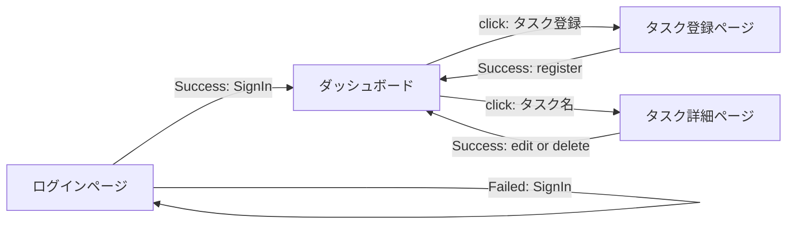
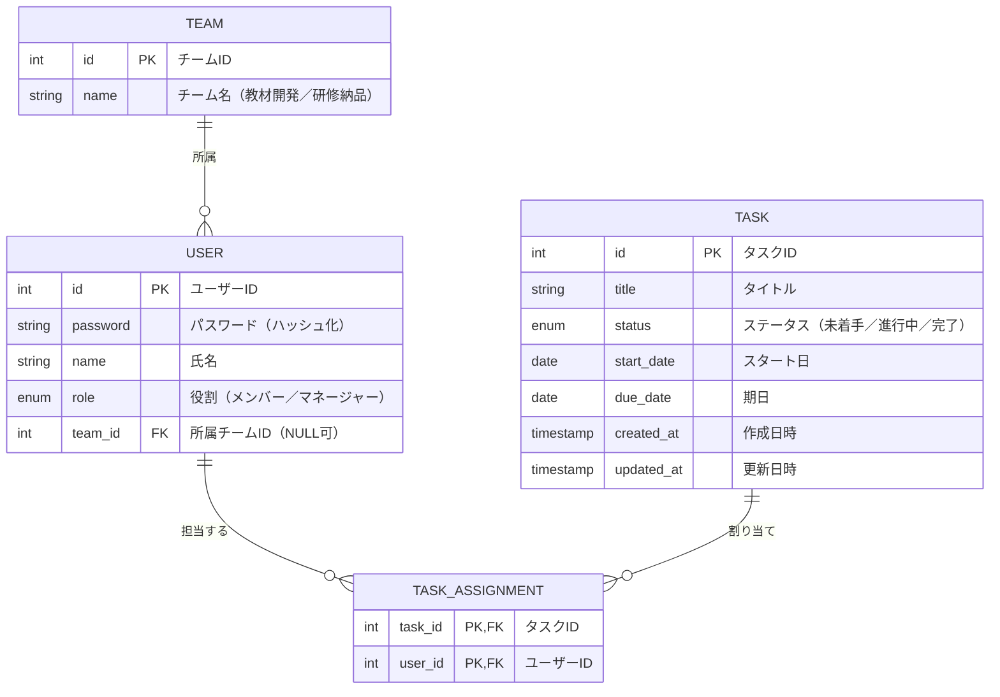
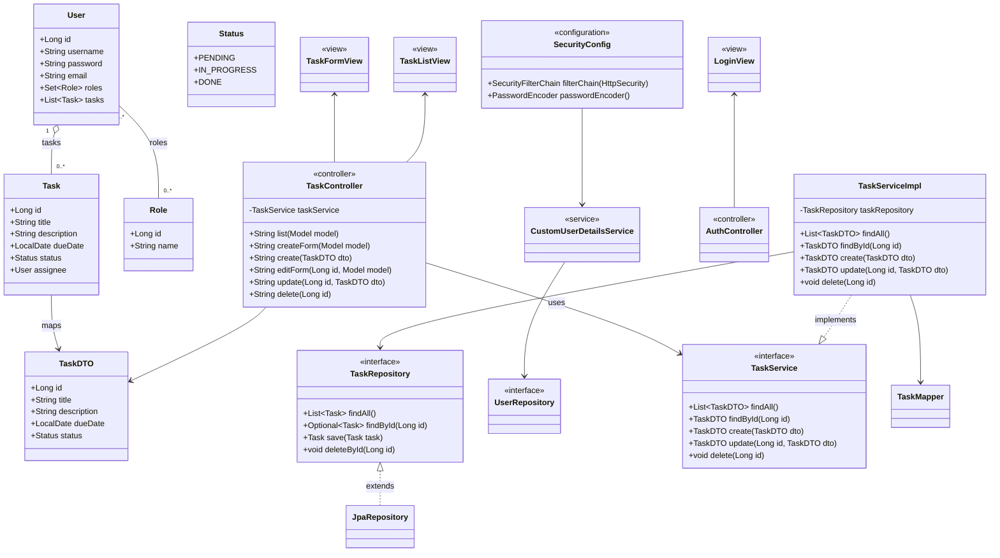

# 要件定義書
<!-- 要件定義書.md -->
### 背景・現状
- 顧客はIT企業の新人研修設計・運営部署のマネージャーであり、教材開発チーム（5名）と研修納品チーム（5名）、計10名のタスクを一元管理できる自社専用タスク管理アプリを求めている :contentReference[oaicite:0]{index=0}。  
- 情報が散乱し、共有コストが高い。
- 社内規定が厳しく、既存のタスク管理ツールに自社情報を入れるのが禁止されている。

### 課題整理
- 現状の業務フロー…情報が「散乱」→具体的にどのように散乱しているのか？
- あるべき業務フロー…自社専用のタスク管理ツールで合計10人のメンバーのタスクを楽に管理できるアプリ
   →「楽に」とは具体的にどのような機能のことを指すのか

### 課題
- Notionを用いたタスク管理が形骸化している
- 担当者が不明確で、タスク漏れが発生する
- タスクのリアルタイムな進捗確認ができない
- タスクのステータス管理が統一されていない
- タスクの登録が分散しており、全体像が把握しにくい

- メンバーのタスクを楽に管理できるアプリが欲しい
- 自社専用のタスク管理ツールが欲しい

### 目的
-　メンバーごとのタスク可視化とリアルタイムな進捗共有
-  タスクを一元管理できる社内専用ツールを構築し、業務効率を改善する 
-　セキュリティ要件を満たした社内完結型のツールを提供する 

### 概要
 本システムは、研修部門の教材開発チームおよび研修納品チームに所属する計10名のメンバーが、プロジェクトごとのタスクを効率的に登録・共有・管理できるWebベースの社内向けタスク管理アプリである。 

Webブラウザ上で動作するタスク管理プラットフォーム。  
- **メンバー**はログイン後、自身のタスクを登録・編集・削除し、ステータス管理が可能。  
- **マネージャー**はチーム全体のタスクを俯瞰し、プロジェクト単位での進捗管理やメンバーへのタスク割り当てを行う。

### システム方式・構成
- フロントエンド:HTML, CSS, JavaScript(Tlymeleaf)
- バックエンド:Spring Boot
- データベース:H2

### 用語定義
- タスク：登録・管理・完了が必要な業務や作業単位のこと
- ステータス：タスクの進行状況を示す状態（未着手／進行中／完了）
- ダッシュボード：タスク全体の進捗状況を一覧で表示する画面
- システム：今回開発対象となるタスク管理アプリのこと

### 機能要件
1. **必須機能**  
   1.1 タスク登録機能  
   1.2 タスク更新機能  
   1.3 タスク削除機能
    
2. **選択機能（チーム開発規模に合わせ選定）**  
   2.1 ログイン機能
   2.2 タスクスケジュール管理機能
   2.3 タスクステータス機能
   2.4 タスク担当者機能

### 現状の業務フロー
1.業務の発生に応じて、マネージャーまたはメンバーがそれぞれタスクを把握し、Notionで管理・指示を行っている
2.進捗確認は朝礼などで口頭報告
3.タスクの遅延や重複があっても見逃されるケースがある

### あるべき業務フロー
1. 業務の発生に応じて、マネージャーまたはメンバーがWeb上でタスクを登録
2. メンバーが自分のタスク一覧をリアルタイムで確認
3．メンバーが自身のタスクを確認し、ステータスを更新
4．マネージャーがダッシュボードでリアルタイムに進捗確認
5. 必要に応じてメンバーの再割当やタスク調整

### 利用者一覧 (ペルソナ)
- 部署のマネージャー 
- 教材開発メンバー（5人）
- 研修納品メンバー（5人）   

### ユースケース
- UC1: メンバーはログインする
- UC2: メンバーがタスクの登録をする
- UC3: メンバーがタスクのステータスを更新する
- UC4: メンバーが所有のタスク一覧を閲覧する
- UC5: マネージャーがメンバー全員のタスク一覧を閲覧する
- UC6: マネージャーがタスクの担当者、ステータス、期日、タイトル、詳細を編集・閲覧・削除をする

# 基本設計
<!-- 基本設計\画面遷移図.md -->

<!-- 基本設計\画面レイアウト図.md -->
## ログイン画面
### レイアウト

### 項目一覧表
| 番号 | 項目名           | 種別    | 概要                             | 制約        | エラー動作                                 | 備考               |
| ---- | ---------------- | ------- | -------------------------------- | ----------- | ------------------------------------------ | ------------------ |
| 1    | ユーザーID       | 固定ラベル | 「ユーザーID」をラベルとして表示 | なし        | なし                                       |                    |
| 2    | ユーザーID入力   | フォーム  | ログイン用ユーザーIDを入力         | 必須        | 未入力でエラーメッセージを表示する。        |                    |
| 3    | パスワード       | 固定ラベル | 「パスワード」をラベルとして表示   | なし        | なし                                       |                    |
| 4    | パスワード入力   | フォーム  | パスワードを入力                   | 必須        | 未入力で／不一致でエラーメッセージを表示    | 非表示入力         |
| 5    | ログインボタン   | ボタン    | 認証を実行して「ダッシュボード」へ | 入力必須    | 入力不足や認証失敗でエラーメッセージを表示  |                    |
| 6    | エラーメッセージ | テキスト  | エラーメッセージを表示             | なし        | なし                                       | エラー発生時のみ表示 |
| 7    | 閉じるボタン     | ボタン    | エラーメッセージを閉じる           | なし        | なし                                       | エラー発生時のみ表示 |

## ダッシュボード画面
### レイアウト

### 項目一覧表
| 番号 | 項目名               | 種別     | 概要                       | 制約    | エラー動作                         | 備考                         |
| ---- | -------------------- | -------- | -------------------------- | ------- | ---------------------------------- | ---------------------------- |
| 1    | タスク一覧           | テーブル  | タスクのリストを一覧表示    | なし    | 読込失敗でエラーメッセージを表示   |                              |
| 2    | タスク登録ボタン     | ボタン    | 「タスク詳細ページ」へ遷移  | なし    | なし                               |                              |
| 3    | ステータス変更ボタン | セレクト  | ステータスの選択肢を表示    | なし    | なし                               | 未着手・進行中・完了から選択 |
| 4    | ログアウトボタン     | ボタン    | 「ログイン画面」へ遷移      | なし    | なし                               |                              |
| 5    | エラーメッセージ表示 | テキスト  | エラーメッセージを表示      | なし    | なし                               | エラー発生時のみ表示         |
| 6    | 閉じるボタン         | ボタン    | メッセージを閉じる          | なし    | なし                               | エラー発生時のみ表示         |

## タスク登録画面
### レイアウト

### 項目一覧表
| 番号     | 項目名           | 種別     | 概要                                       | 制約               | エラー動作                                       | 備考                                 |
| -------- | ---------------- | -------- | ------------------------------------------ | ------------------ | ------------------------------------------------ | ------------------------------------ |
| 1        | 戻るボタン       | ボタン    | 一覧画面に戻る                             | なし               | なし                                             |                                      |
| 2        | ページタイトル   | 固定ラベル | 「タスク登録ページ」として表示             | なし               | なし                                             |                                      |
| 3・８    | タスク名         | テキスト  | タスクのタイトル                           | 最大50文字         | 未入力時エラーメッセージを表示                   |                                      |
| 4・９    | メンバー名       | セレクト  | 担当者の名前選択                           | 選択必須           | 未選択時エラーメッセージを表示                   | チェックボックスで複数選択可能      |
| ５・１０ | 状態             | セレクト  | タスクの進捗状況選択（未着手・進行中・完了等） | なし               | 未選択時エラーメッセージを表示                   |                                      |
| 6・１１  | 開始日           | 日付      | タスクの開始日                             | 未来日不可         | 不正な日付でエラーメッセージを表示               |                                      |
| 7・１２  | 完了予定日       | 日付      | タスクの完了予定日                         | 開始日より前は不可 | 不正な日付でエラーメッセージを表示               |                                      |
| 13       | 登録ボタン       | ボタン    | 入力内容でタスク情報を更新                 | 必須項目入力必要   | 入力不足時は更新不可・エラーメッセージを表示     |                                      |
| 14       | エラーメッセージ | テキスト  | エラーメッセージを表示                     | なし               | なし                                             | エラー発生時のみ表示                |
| 15       | 閉じるボタン     | ボタン    | メッセージを閉じる                         | なし               | なし                                             | エラー発生時のみ表示                |

## タスク詳細画面
### レイアウト

### 項目一覧表
| 番号 | 項目名           | 種別     | 概要                                 | 制約                   | エラー動作                                               | 備考                         |
| ---- | ---------------- | -------- | ------------------------------------ | ---------------------- | -------------------------------------------------------- | ---------------------------- |
| 1    | 戻るボタン       | ボタン    | 一覧画面に戻る                       | なし                   | なし                                                     |                              |
| 2    | ページタイトル   | 固定ラベル | 「タスク詳細ページ」として表示       | なし                   | なし                                                     |                              |
| 3    | タスク           | テーブル  | 「ダッシュボード」で選択したタスクの詳細 | なし                   | なし                                                     |                              |
| 4    | タスク編集       | テーブル  | 選択したタスクを編集                 | なし                   | なし                                                     |                              |
| 5    | タスク名         | テキスト  | タスクのタイトル                     | 最大50文字             | 未入力時エラーメッセージを表示                           | 編集可能                     |
| 6    | メンバー名       | セレクト  | 担当者の名前選択または入力           | 選択必須               | 未選択時エラーメッセージを表示                           | チェックボックスで複数選択可能 |
| 7    | 状態             | セレクト  | タスクの進捗状況選択（未着手・進行中・完了等） | なし                   | 未選択時エラーメッセージを表示                           |                              |
| 8    | 開始日           | 日付      | タスクの開始日                       | 未来日不可             | 不正な日付でエラーメッセージを表示                       |                              |
| 9    | 完了予定日       | 日付      | タスクの完了予定日                   | 開始日より前は不可     | 不正な日付でエラーメッセージを表示                       |                              |
| 10   | 更新ボタン       | ボタン    | 入力内容でタスク情報を更新           | 必須項目入力必要       | 入力不足時は更新不可・エラーメッセージを表示             |                              |
| 11   | 削除ボタン       | ボタン    | タスクを削除                         | なし                   | 削除確認ダイアログ→削除失敗時エラーメッセージを表示     | 取り消し不可                 |
| 12   | キャンセルボタン | ボタン    | 編集内容を保存しない                 | なし                   | なし                                                     |                              |
| 13   | エラーメッセージ | テキスト  | エラーメッセージを表示               | なし                   | なし                                                     | エラー発生時のみ表示         |
| 14   | 閉じるボタン     | ボタン    | メッセージを閉じる                   | なし                   | なし                                                     | エラー発生時のみ表示         |

<!-- 基本設計\ER図.md -->

# 詳細設計
<!-- 詳細設計\クラス図.md -->
