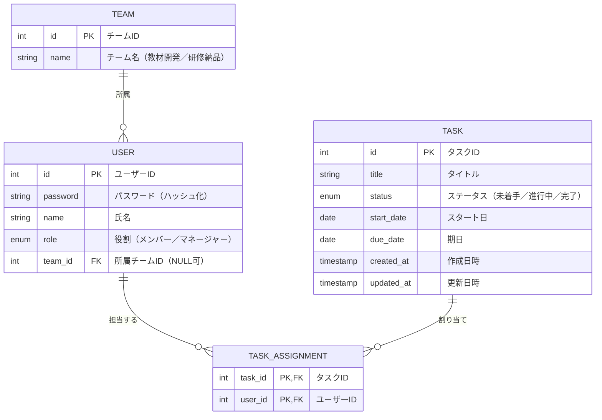

```mermaid
erDiagram
    TEAM {
        int id PK "チームID"
        string name "チーム名（教材開発／研修納品）"
    }

    USER {
        int id PK "ユーザーID"
        string password "パスワード（ハッシュ化）"
        string name "氏名"
        enum role "役割（メンバー／マネージャー）"
        int team_id FK "所属チームID（NULL可）"
    }

    TASK {
        int id PK "タスクID"
        string title "タイトル"
        enum status "ステータス（未着手／進行中／完了）"
        date start_date "スタート日"
        date due_date "期日"
        timestamp created_at "作成日時"
        timestamp updated_at "更新日時"
    }

    TASK_ASSIGNMENT {
        int task_id PK, FK "タスクID"
        int user_id PK, FK "ユーザーID"
    }

    TEAM ||--o{ USER : "所属"
    USER ||--o{ TASK_ASSIGNMENT : "担当する"
    TASK ||--o{ TASK_ASSIGNMENT : "割り当て"
```