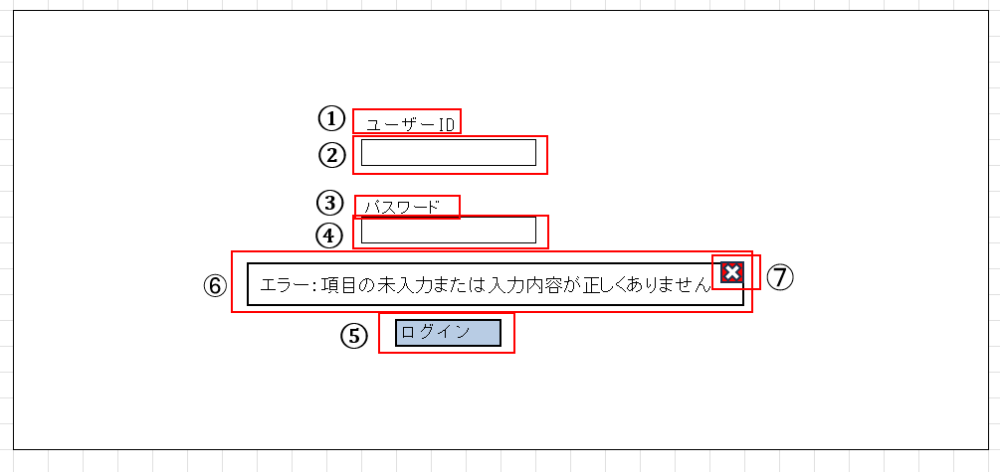
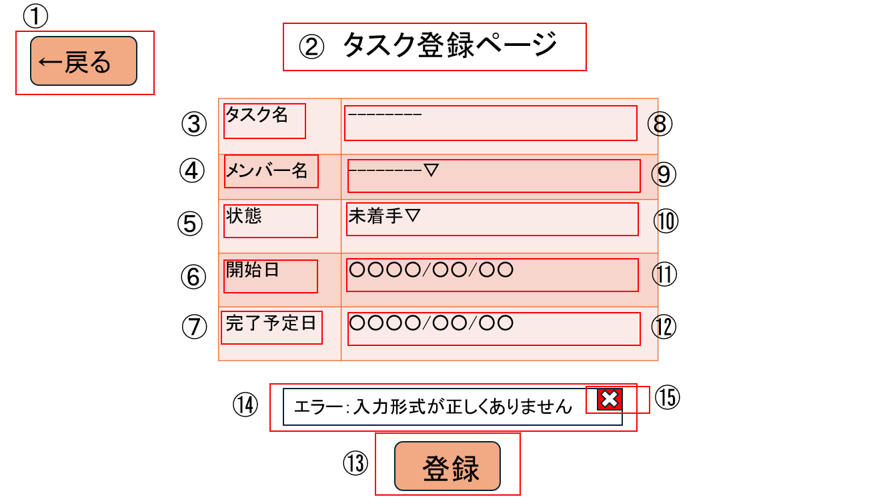
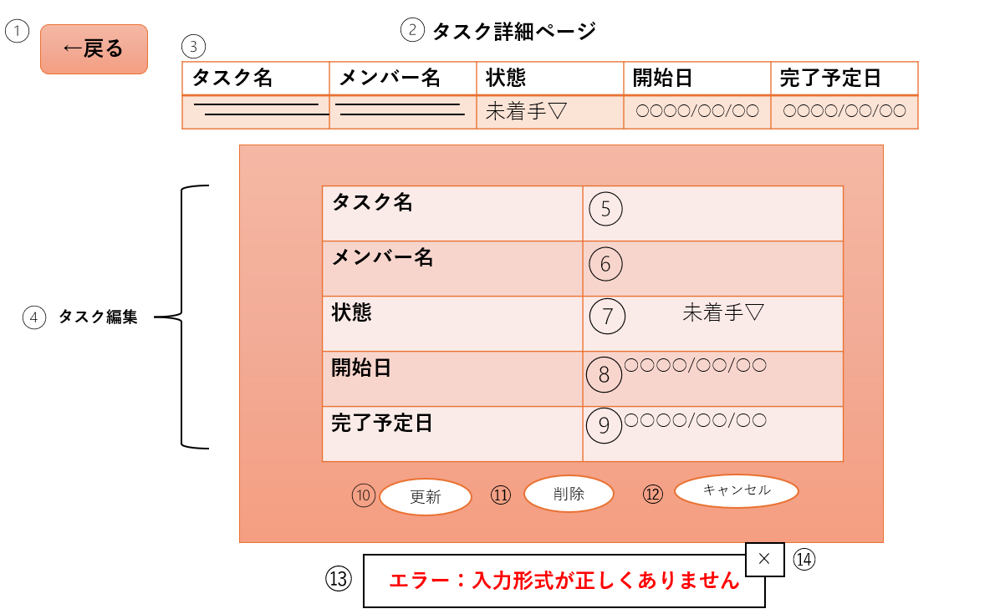

## ログイン画面
### レイアウト

### 項目一覧表
| 番号 | 項目名           | 種別    | 概要                             | 制約        | エラー動作                                 | 備考               |
| ---- | ---------------- | ------- | -------------------------------- | ----------- | ------------------------------------------ | ------------------ |
| 1    | ユーザーID       | 固定ラベル | 「ユーザーID」をラベルとして表示 | なし        | なし                                       |                    |
| 2    | ユーザーID入力   | フォーム  | ログイン用ユーザーIDを入力         | 必須        | 未入力でエラーメッセージを表示する。        |                    |
| 3    | パスワード       | 固定ラベル | 「パスワード」をラベルとして表示   | なし        | なし                                       |                    |
| 4    | パスワード入力   | フォーム  | パスワードを入力                   | 必須        | 未入力で／不一致でエラーメッセージを表示    | 非表示入力         |
| 5    | ログインボタン   | ボタン    | 認証を実行して「ダッシュボード」へ | 入力必須    | 入力不足や認証失敗でエラーメッセージを表示  |                    |
| 6    | エラーメッセージ | テキスト  | エラーメッセージを表示             | なし        | なし                                       | エラー発生時のみ表示 |
| 7    | 閉じるボタン     | ボタン    | エラーメッセージを閉じる           | なし        | なし                                       | エラー発生時のみ表示 |

## ダッシュボード画面
### レイアウト

### 項目一覧表
| 番号 | 項目名               | 種別     | 概要                       | 制約    | エラー動作                         | 備考                         |
| ---- | -------------------- | -------- | -------------------------- | ------- | ---------------------------------- | ---------------------------- |
| 1    | タスク一覧           | テーブル  | タスクのリストを一覧表示    | なし    | 読込失敗でエラーメッセージを表示   |                              |
| 2    | タスク登録ボタン     | ボタン    | 「タスク詳細ページ」へ遷移  | なし    | なし                               |                              |
| 3    | ステータス変更ボタン | セレクト  | ステータスの選択肢を表示    | なし    | なし                               | 未着手・進行中・完了から選択 |
| 4    | ログアウトボタン     | ボタン    | 「ログイン画面」へ遷移      | なし    | なし                               |                              |
| 5    | エラーメッセージ表示 | テキスト  | エラーメッセージを表示      | なし    | なし                               | エラー発生時のみ表示         |
| 6    | 閉じるボタン         | ボタン    | メッセージを閉じる          | なし    | なし                               | エラー発生時のみ表示         |

## タスク登録画面
### レイアウト

### 項目一覧表
| 番号     | 項目名           | 種別     | 概要                                       | 制約               | エラー動作                                       | 備考                                 |
| -------- | ---------------- | -------- | ------------------------------------------ | ------------------ | ------------------------------------------------ | ------------------------------------ |
| 1        | 戻るボタン       | ボタン    | 一覧画面に戻る                             | なし               | なし                                             |                                      |
| 2        | ページタイトル   | 固定ラベル | 「タスク登録ページ」として表示             | なし               | なし                                             |                                      |
| 3・８    | タスク名         | テキスト  | タスクのタイトル                           | 最大50文字         | 未入力時エラーメッセージを表示                   |                                      |
| 4・９    | メンバー名       | セレクト  | 担当者の名前選択                           | 選択必須           | 未選択時エラーメッセージを表示                   | チェックボックスで複数選択可能      |
| ５・１０ | 状態             | セレクト  | タスクの進捗状況選択（未着手・進行中・完了等） | なし               | 未選択時エラーメッセージを表示                   |                                      |
| 6・１１  | 開始日           | 日付      | タスクの開始日                             | 未来日不可         | 不正な日付でエラーメッセージを表示               |                                      |
| 7・１２  | 完了予定日       | 日付      | タスクの完了予定日                         | 開始日より前は不可 | 不正な日付でエラーメッセージを表示               |                                      |
| 13       | 登録ボタン       | ボタン    | 入力内容でタスク情報を更新                 | 必須項目入力必要   | 入力不足時は更新不可・エラーメッセージを表示     |                                      |
| 14       | エラーメッセージ | テキスト  | エラーメッセージを表示                     | なし               | なし                                             | エラー発生時のみ表示                |
| 15       | 閉じるボタン     | ボタン    | メッセージを閉じる                         | なし               | なし                                             | エラー発生時のみ表示                |

## タスク詳細画面
### レイアウト

### 項目一覧表
| 番号 | 項目名           | 種別     | 概要                                 | 制約                   | エラー動作                                               | 備考                         |
| ---- | ---------------- | -------- | ------------------------------------ | ---------------------- | -------------------------------------------------------- | ---------------------------- |
| 1    | 戻るボタン       | ボタン    | 一覧画面に戻る                       | なし                   | なし                                                     |                              |
| 2    | ページタイトル   | 固定ラベル | 「タスク詳細ページ」として表示       | なし                   | なし                                                     |                              |
| 3    | タスク           | テーブル  | 「ダッシュボード」で選択したタスクの詳細 | なし                   | なし                                                     |                              |
| 4    | タスク編集       | テーブル  | 選択したタスクを編集                 | なし                   | なし                                                     |                              |
| 5    | タスク名         | テキスト  | タスクのタイトル                     | 最大50文字             | 未入力時エラーメッセージを表示                           | 編集可能                     |
| 6    | メンバー名       | セレクト  | 担当者の名前選択または入力           | 選択必須               | 未選択時エラーメッセージを表示                           | チェックボックスで複数選択可能 |
| 7    | 状態             | セレクト  | タスクの進捗状況選択（未着手・進行中・完了等） | なし                   | 未選択時エラーメッセージを表示                           |                              |
| 8    | 開始日           | 日付      | タスクの開始日                       | 未来日不可             | 不正な日付でエラーメッセージを表示                       |                              |
| 9    | 完了予定日       | 日付      | タスクの完了予定日                   | 開始日より前は不可     | 不正な日付でエラーメッセージを表示                       |                              |
| 10   | 更新ボタン       | ボタン    | 入力内容でタスク情報を更新           | 必須項目入力必要       | 入力不足時は更新不可・エラーメッセージを表示             |                              |
| 11   | 削除ボタン       | ボタン    | タスクを削除                         | なし                   | 削除確認ダイアログ→削除失敗時エラーメッセージを表示     | 取り消し不可                 |
| 12   | キャンセルボタン | ボタン    | 編集内容を保存しない                 | なし                   | なし                                                     |                              |
| 13   | エラーメッセージ | テキスト  | エラーメッセージを表示               | なし                   | なし                                                     | エラー発生時のみ表示         |
| 14   | 閉じるボタン     | ボタン    | メッセージを閉じる                   | なし                   | なし                                                     | エラー発生時のみ表示         |
