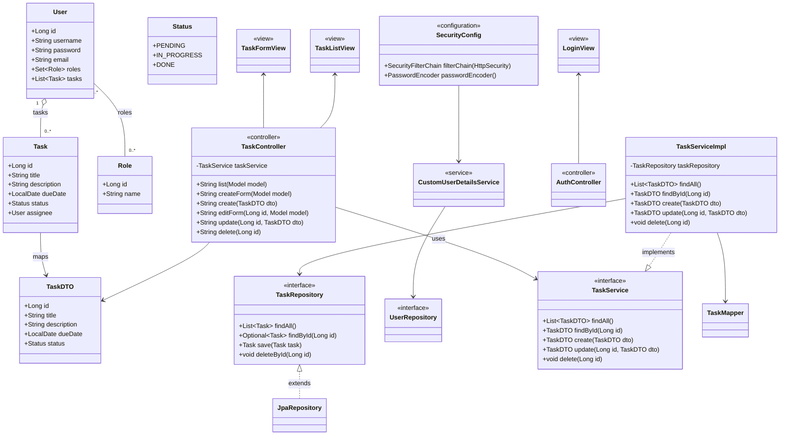

```mermaid
classDiagram
    direction TB

    %% ========= エンティティ =========
    class Task {
        +Long id
        +String title
        +String description
        +LocalDate dueDate
        +Status status
        +User assignee
    }

    class User {
        +Long id
        +String username
        +String password
        +String email
        +Set~Role~ roles
        +List~Task~ tasks
    }

    class Status {
        +PENDING
        +IN_PROGRESS
        +DONE
    }

    class Role {
        +Long id
        +String name
    }

    %% ========= DTO =========
    class TaskDTO {
        +Long id
        +String title
        +String description
        +LocalDate dueDate
        +Status status
    }

    %% ========= Repository =========
    class TaskRepository {
        <<interface>>
        +List~Task~ findAll()
        +Optional~Task~ findById(Long id)
        +Task save(Task task)
        +void deleteById(Long id)
    }

    class UserRepository {
        <<interface>>
    }

    %% ========= Service =========
    class TaskService {
        <<interface>>
        +List~TaskDTO~ findAll()
        +TaskDTO findById(Long id)
        +TaskDTO create(TaskDTO dto)
        +TaskDTO update(Long id, TaskDTO dto)
        +void delete(Long id)
    }

    class TaskServiceImpl {
        -TaskRepository taskRepository
        +List~TaskDTO~ findAll()
        +TaskDTO findById(Long id)
        +TaskDTO create(TaskDTO dto)
        +TaskDTO update(Long id, TaskDTO dto)
        +void delete(Long id)
    }

    %% ========= Controller =========
    class TaskController {
        <<controller>>
        -TaskService taskService
        +String list(Model model)
        +String createForm(Model model)
        +String create(TaskDTO dto)
        +String editForm(Long id, Model model)
        +String update(Long id, TaskDTO dto)
        +String delete(Long id)
    }

    class AuthController {
        <<controller>>
    }

    %% ========= Security & Config =========
    class SecurityConfig {
        <<configuration>>
        +SecurityFilterChain filterChain(HttpSecurity)
        +PasswordEncoder passwordEncoder()
    }

    class CustomUserDetailsService {
        <<service>>
    }

    %% ========= Thymeleaf View (代表レイヤ) =========
    class TaskListView {
        <<view>>
    }
    class TaskFormView {
        <<view>>
    }
    class LoginView {
        <<view>>
    }

    %% ========= リレーション =========
    User "1" o-- "0..*" Task : tasks
    User "0..*" -- "0..*" Role : roles
    TaskRepository <|.. JpaRepository : extends
    TaskServiceImpl ..|> TaskService : implements
    TaskController --> TaskService : uses
    TaskServiceImpl --> TaskRepository
    TaskServiceImpl --> TaskMapper
    TaskController --> TaskDTO
    Task --> TaskDTO : maps
    CustomUserDetailsService --> UserRepository
    SecurityConfig --> CustomUserDetailsService
    TaskListView <-- TaskController
    TaskFormView <-- TaskController
    LoginView <-- AuthController

```